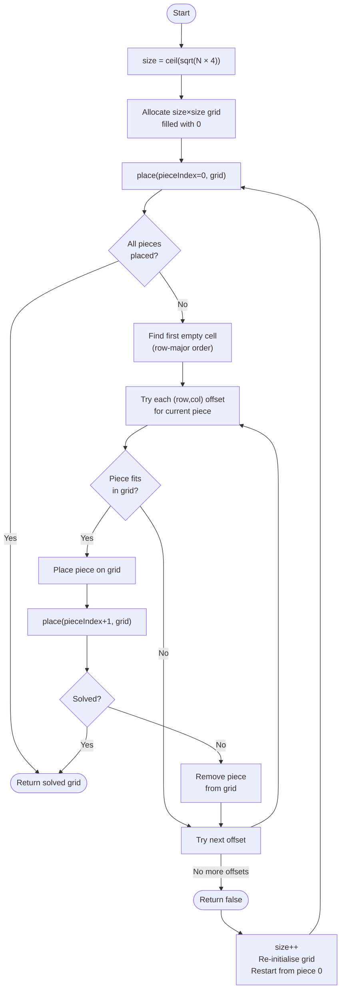

# Architecture: Tetris Optimizer

## 1. Overview

Tetris Optimizer is a Go command-line application that reads a set of tetrominoes from a text file and assembles them into the smallest possible square grid using a backtracking algorithm. The architecture follows idiomatic Go project layout conventions with `cmd/` and `internal/` separation, and is driven by test-first development (TDD).

---

## 2. Project Structure

```
tetris-optimizer/
├── cmd/
│   └── tetris-optimizer/
│       ├── main.go               # Entry point; CLI argument handling & orchestration
│       └── main_test.go          # Integration tests (end-to-end via compiled binary)
├── internal/
│   ├── parser/
│   │   ├── parser.go             # File reading, tetromino parsing & validation
│   │   └── parser_test.go        # Unit tests for parser
│   ├── solver/
│   │   ├── solver.go             # Backtracking algorithm; smallest-square assembly
│   │   └── solver_test.go        # Unit tests for solver
│   └── printer/
│       ├── printer.go            # Grid rendering to stdout with A–Z letter mapping
│       └── printer_test.go       # Unit tests for printer
├── testdata/
│   ├── valid_single.txt          # 1 tetromino (integration baseline)
│   ├── valid_multi.txt           # 5-piece solvable input
│   ├── valid_26.txt              # 26-piece stress test input
│   ├── valid_l_piece.txt         # L-piece normalisation fixture
│   ├── empty.txt                 # Empty file (0 tetrominoes)
│   ├── invalid_chars.txt         # Contains illegal character 'X'
│   ├── invalid_dimensions.txt    # Grid with only 3 rows (not 4×4)
│   ├── invalid_blocks.txt        # Grid with 3 '#' (too few)
│   ├── invalid_blocks_high.txt   # Grid with 5 '#' (too many)
│   ├── invalid_disjoint.txt      # Two separate pairs of '##' (not contiguous)
│   ├── invalid_spacing.txt       # Double blank line between pieces
│   └── invalid_too_many.txt      # 27 tetrominoes (exceeds A–Z limit)
├── docs/
│   ├── Architecture.md           # This file
│   ├── PRD.md                    # Product Requirements Document
│   └── tasks/                    # Per-feature TDD task files
│       ├── TASK-01-project-setup.md
│       ├── TASK-02-core-data-types.md
│       ├── TASK-03-parser-file-reading.md
│       ├── TASK-04-parser-shape-validation.md
│       ├── TASK-05-solver-grid-init.md
│       ├── TASK-06-solver-backtracking.md
│       ├── TASK-07-printer-rendering.md
│       ├── TASK-08-main-entrypoint.md
│       └── TASK-09-stress-test-verification.md
├── go.mod
└── README.md
```

---

## 3. Package Responsibilities

| Package | File | Responsibility |
|---|---|---|
| `cmd/tetris-optimizer` | `main.go` | Validate exactly 1 CLI arg; delegate to parser → solver → printer; print `ERROR` on failure |
| `internal/parser` | `parser.go` | Open & read file; parse 4×4 blocks; validate characters, dimensions, block count, contiguity |
| `internal/solver` | `solver.go` | Compute minimum square size; place tetrominoes via backtracking; grow grid if needed |
| `internal/printer` | `printer.go` | Map piece index → letter (A–Z); render 2D grid rows to stdout |

---

## 4. Core Data Types

```go
// internal/parser/parser.go

// Tetromino represents a parsed and validated tetris piece.
type Tetromino struct {
    // Cells holds the (row, col) offsets of each of the 4 blocks,
    // normalised so the top-left occupied cell is (0,0).
    Cells [4][2]int
}
```

```go
// internal/solver/solver.go

// Grid is the mutable square board used during backtracking.
// 0 means empty; values 1..N map to tetrominoes A..Z.
type Grid [][]int
```

---

## 5. Data Flow

```mermaid
flowchart TD
    A([CLI: os.Args]) --> B[main.go\nValidate args]
    B -->|path| C[parser.Parse\nRead file]
    C -->|[]Tetromino| D[solver.Solve\nBacktracking]
    D -->|Grid + labels| E[printer.Print\nRender stdout]
    B -->|wrong arg count| ERR([stdout: ERROR])
    C -->|parse / validation error| ERR
    D -->|solver error| ERR
```

---

## 6. Backtracking Algorithm



> **Minimum size optimisation:** `size = ⌈√(N × 4)⌉`. If backtracking exhausts all positions, increment `size` by 1 and retry. Maximum `N` is 26 (A–Z constraint).

---

## 7. Error Handling Contract

All errors surface as the literal string `ERROR\n` written to stdout (or stderr). The program exits with a non-zero status code.

| Condition | Detected in |
|---|---|
| Wrong number of CLI arguments (≠ 1) | `main.go` |
| File does not exist / cannot be read | `parser` |
| Zero tetrominoes in file | `parser` |
| Invalid characters (not `.`, `#`, `\n`) | `parser` |
| Grid dimensions not 4×4 | `parser` |
| Block count ≠ 4 per grid | `parser` |
| Blocks not contiguous | `parser` |
| Incorrect spacing (multiple/trailing blank lines) | `parser` |
| More than 26 tetrominoes | `parser` |

---

## 8. TDD Test Scenarios

### 8.1 `internal/parser`

#### Valid inputs

| Scenario | Input | Expected output |
|---|---|---|
| Single I-piece (horizontal) | 4×4 grid with `####` on row 0 | `[]Tetromino` of length 1; cells `[0,0],[0,1],[0,2],[0,3]` |
| Two pieces separated by one blank line | Two valid 4×4 grids | `[]Tetromino` of length 2 |
| All 26 pieces | File with 26 valid grids | Slice length 26 |
| L-piece (normalised) | Grid with L-shape | Cells normalised to `(0,0)` top-left |

#### Invalid inputs — must return an error

| Scenario | Input |
|---|---|
| Zero arguments | Empty file (0 blocks) |
| Invalid character `X` | File containing `X` |
| 3×4 grid instead of 4×4 | Grid with only 3 rows |
| 3 `#` in a grid | Grid with 3 hashes |
| Disjoint blocks | Grid with two separate pairs of `##` |
| Two consecutive blank lines between shapes | `\n\n\n` separator |
| Trailing blank line at end of file | File ending with `\n\n` |
| 27 valid tetrominoes | File with 27 pieces |

---

### 8.2 `internal/solver`

#### Correctness

| Scenario | Input | Expected |
|---|---|---|
| Single I-piece | `[{Cells:[0,0],[0,1],[0,2],[0,3]}]` | 2×2 grid, size=2 (minimum is `⌈√4⌉=2`) |
| Two pieces that tile a 2×4 rectangle | 2 I-pieces | Grid size=3 (fits in 3×3) |
| Known 5-piece puzzle | 5 tetrominoes from sample file | Correct solved 5×4 or smaller square |
| No overlap invariant | Any valid solve | No two pieces share a cell |
| Full square invariant | N pieces tiling perfectly | Zero `.` (period) cells in output |
| Imperfect fill | N pieces that cannot tile perfectly | Remaining cells are 0 (empty/period) |

#### Edge cases

| Scenario | Expected |
|---|---|
| 26 pieces (stress) | Returns within 10 s without panic |
| Minimum size grows | If `size` fails, solver retries with `size+1` |

---

### 8.3 `internal/printer`

| Scenario | Input | Expected stdout |
|---|---|---|
| Single piece, index 0 | 2×2 grid with piece `1` at `(0,0),(0,1),(1,0),(1,1)` | `AA\nAA\n` |
| Mixed grid | 3×3 with piece 1 at top-left, piece 2 at bottom-right | `AA.\nAA.\n..B\n` → adjusted per actual placement |
| Empty cell rendered | Grid cell value 0 | `.` |
| Letter mapping | Piece index 0→A, 1→B, …, 25→Z | Correct uppercase letter |
| Each row ends with `\n` | Any solved grid | Every row terminated by newline |

---

### 8.4 Integration (end-to-end via `cmd/tetris-optimizer`)

| Scenario | Command | Expected |
|---|---|---|
| Valid single piece | `./tetris-optimizer testdata/valid_single.txt` | Correct square, exit 0 |
| Valid multi-piece | `./tetris-optimizer testdata/valid_multi.txt` | Matches golden baseline file |
| No argument | `./tetris-optimizer` | `ERROR\n`, exit ≠ 0 |
| Two arguments | `./tetris-optimizer a.txt b.txt` | `ERROR\n`, exit ≠ 0 |
| Non-existent file | `./tetris-optimizer missing.txt` | `ERROR\n`, exit ≠ 0 |
| Invalid chars file | `./tetris-optimizer testdata/invalid_chars.txt` | `ERROR\n` |
| 26-piece stress test | `./tetris-optimizer testdata/valid_26.txt` | Solves within 10 s, valid output |

---

## 9. Dependency Policy

Per the PRD, **only Go standard library packages** are permitted:

- `fmt`, `os`, `bufio`, `strings`, `math`, `strconv`, `testing`

No third-party modules. `go.mod` must declare `require` with no external entries.

---

## 10. Build & Test Commands

```bash
# Run all unit tests with verbose output and race detector
go test -v -race ./...

# Run integration tests only
go test -v -run TestIntegration ./cmd/tetris-optimizer/...

# Build binary
go build -o tetris-optimizer ./cmd/tetris-optimizer/

# Run stress test (26 pieces)
time ./tetris-optimizer testdata/valid_26.txt
```
