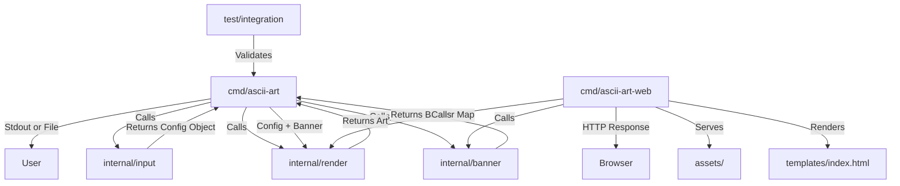

# System Architecture

## Overview
The ASCII Art Generator follows the **Standard Go Project Layout**, ensuring scalability, maintainability, and clear separation of concerns. The project provides two entrypoints: a **CLI application** (`cmd/ascii-art`) and a **Web server** (`cmd/ascii-art-web`). Both share the same core packages for banner loading, rendering, and data models.

## Component Diagram



## Modules

### 1. CLI Controller (`cmd/ascii-art/main.go`)
*   **Responsibility:** CLI orchestration.
*   **Flow:**
    1.  Calls `Input Parser` to validate and sanitize arguments.
    2.  Calls `Banner Loader` to read the font file.
    3.  Passes the string and banner to the `Renderer`.
    4.  Prints the result to the console.

### 2. Web Controller (`cmd/ascii-art-web/main.go`)
*   **Responsibility:** HTTP server orchestration.
*   **Components:**
    *   `PageData` struct — holds `Input`, `Banner`, `Result`, `Error` for template rendering.
    *   `homeHandler` — serves `GET /` with the form (defaults to `standard` banner).
    *   `asciiArtHandler` — handles `POST /ascii-art`: validates input, loads banner, renders ASCII art, returns result via template.
    *   Static file server — serves `/assets/` for images and other static resources.
*   **Flow:**
    1.  Receives HTTP request.
    2.  Validates form input (text, banner name, ASCII range).
    3.  Calls `Banner Loader` to read the font file.
    4.  Passes the text and banner to the `Renderer`.
    5.  Renders the HTML template with the result or error.

### 3. Input Layer (`internal/input`)
*   **Responsibility:** Validation and Sanitization (CLI only).
*   **Key Functions:**
    *   `ParseArgs(args []string) (*Config, error)`: Parses flags (`--color`, `--output`, `--align`), handles positional arguments, and validates input.

### 4. Data Layer (`internal/banner`)
*   **Responsibility:** Data Access.
*   **Key Functions:**
    *   `LoadBanner(filename string) (Banner, error)`: Reads the file, splits by double newline (or specific separator), and maps runes to 8-line string slices.

### 5. Logic Layer (`internal/render`)
*   **Responsibility:** Core Logic.
*   **Key Functions:**
    *   `Render(config *Config, b Banner) string`: Generates the ASCII art, applies ANSI color codes if requested, and aligns text based on terminal width.

### 6. Templates (`templates/`)
*   **Responsibility:** HTML presentation for the web interface.
*   **Files:**
    *   `index.html` — Dark-themed form with text input, banner radio buttons, result and error display areas. Rendered via Go `html/template`.

### 7. Shared Models (`pkg/model`)
*   **Responsibility:** Data Contracts.
*   **Data Structure:**
    *   `type Banner map[rune][]string`
    *   `type Config struct { ... }`: Holds Input string, Banner name, Color settings, Output file path, and Alignment mode.

## Directory Structure
```
.
├── cmd/
│   ├── ascii-art/
│   │   └── main.go           # CLI entry point (wiring only)
│   └── ascii-art-web/
│       └── main.go           # Web server entry point
├── internal/                 # Private application code (not importable by others)
│   ├── banner/               # Banner loading and parsing logic
│   │   ├── loader.go
│   │   └── loader_test.go
│   ├── input/                # Input validation and sanitization (CLI)
│   │   ├── parser.go
│   │   └── parser_test.go
│   └── render/               # ASCII art generation logic
│       ├── renderer.go
│       └── renderer_test.go
├── pkg/                      # Public library code (safe for external use)
│   └── model/                # Shared data structures (e.g., Banner type)
├── templates/                # HTML templates for web interface
│   └── index.html
├── test/                     # External integration tests
│   ├── golden/               # Golden file test cases (.txt files)
│   └── integration_test.go   # "The Tester" - runs binary against golden files
├── docs/                     # Project documentation
│   ├── architecture.md       # This file
│   ├── prd.md                # Product Requirements Document
│   ├── tasks/                # Task breakdown (task_01, task_02, etc.)
│   └── logs/                 # AI interaction logs (ai.log)
├── assets/                   # Static assets
│   └── banners/              # standard.txt, shadow.txt, thinkertoy.txt
├── AGENTS.md                 # AI agent instructions (logging, project context)
├── go.mod
└── Makefile                  # Build and test automation
```